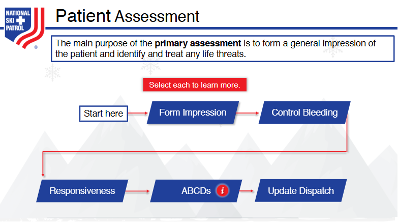
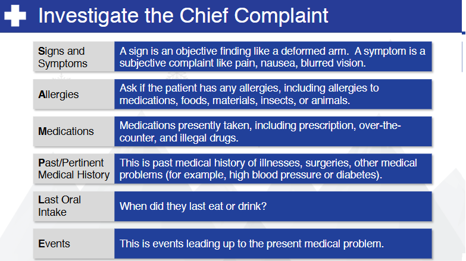

    # Nsp Oec Training Chapter 3 
    ## National Ski Patrol - Outdoor Emergency Care chapter 3
    
Chapter 3: Rescue Basics

1. Describe the steps an OEC technician can take to be prepared when responding to a request for assistance.
2. Describe how layering clothing can help preserve body heat.
3. Describe five modes of disease transmission.
4. Describe the following terms: pathogen, standard precautions, body substance isolation, and hazardous material.
5. List common personal protective equipment used by OEC technicians.
6. Demonstrate how to safety remove contaminated medical gloves.
7. Describe the chain of custody.

## 3.1  OEC Preperation - Be Prepared to Help 

Here are the key steps an Outdoor Emergency Care (OEC) technician can take to be prepared when responding 
to a request for assistance:

1. **Ensure Personal Safety**: Assess and secure the scene to ensure it is safe to approach, and wear appropriate personal protective equipment (PPE).
2. **Gather Equipment**: Carry essential medical supplies and tools, ensuring they are organized and accessible for quick use.
3. **Perform a Scene Size-up**: Evaluate the environment, potential hazards, the number of patients, and the mechanism of injury or illness.
4. **Establish Communication**: Communicate with other responders, dispatch, or bystanders to gather critical information and coordinate efforts.
5. **Maintain a Calm and Focused Attitude**: Stay calm and composed to ensure clear thinking and effective decision-making during the response.

These steps help ensure an OEC technician can respond effectively and provide appropriate care in emergency situations.

## 3.2 Layering clothing

Layering clothing helps preserve body heat by creating a system of insulation and temperature regulation through three main layers:

1. **Base Layer**: Wicks moisture away from the skin to keep the body dry, preventing heat loss due to dampness from sweat.
2. **Middle Layer (Insulating Layer)**: Traps body heat by creating air pockets between fibers, providing warmth and insulation against the cold.
3. **Outer Layer (Shell)**: Protects against wind, rain, and snow, preventing external conditions from cooling the body and maintaining the insulation provided by the inner layers.

This system allows for temperature control by adding or removing layers based on activity level and environmental conditions, helping to retain body heat and prevent hypothermia.

## 3.3  Five modes of disease transmission

Here are five modes of disease transmission, each with a brief description:

1. **Direct Contact Transmission**: Occurs when infectious agents are spread through direct physical contact between an infected person and a susceptible individual (e.g., touching, kissing, sexual contact).
2. **Indirect Contact Transmission**: Involves transmission through an intermediate object or surface (fomite), such as contaminated doorknobs, utensils, or medical equipment.
3. **Droplet Transmission**: Occurs when respiratory droplets carrying infectious agents are expelled by coughing, sneezing, or talking, and are inhaled by or come into contact with a nearby individual.
4. **Airborne Transmission**: Happens when infectious agents are suspended in the air as tiny particles (aerosols) and can be inhaled by people over distances beyond droplet transmission range (e.g., measles, tuberculosis).
5. **Vector-borne Transmission**: Involves the transmission of disease through organisms such as mosquitoes, ticks, or fleas

## Terms for infection control and safety:

1. **Pathogen**: A microorganism, such as a virus, bacteria, fungus, or parasite, that causes disease in humans or other organisms.
2. **Standard Precautions**: A set of infection control practices used to prevent transmission of diseases by treating all blood, body fluids, and potentially infectious materials as if they are infectious, including the use of personal protective equipment (PPE).
3. **Body Substance Isolation (BSI)**: A form of infection control that focuses on isolating all body substances (blood, urine, saliva, etc.) to reduce the risk of transmission of pathogens between patients and healthcare workers.
4. **Hazardous Material (HazMat)**: Any substance that poses a significant risk to health, safety, or the environment, including chemicals, radioactive materials, biological agents, and other potentially harmful substances.

## 3.4 Personal Protective Equipment (PPE) used by OEC technicians:

Here’s a list of common personal protective equipment (PPE) used by OEC technicians:

1. Gloves (usually nitrile or latex-free)
2. Protective eyewear (goggles or safety glasses)
3. Face masks or shields
4. Gowns or protective clothing
5. Resuscitation masks or bag-valve masks (BVM)
6. Boots or sturdy footwear

These items help protect both the technician and the patient from potential hazards and the spread of infections.

## 3.5 Safely Removing Contaminated Medical Gloves

1. **Pinch the outside of one glove**: Using your non-dominant hand, pinch the outside of the glove near the wrist without touching your skin.
2. **Peel the glove off**: Pull the glove away from your wrist, turning it inside out as you remove it.
3. **Hold the removed glove in the gloved hand**: Keep the contaminated glove in the palm of your still-gloved hand.
4. **Slide fingers under the second glove**: Insert your clean fingers under the wrist of the remaining glove, avoiding contact with the contaminated exterior.
5. **Peel the second glove off**: Pull the glove off from the inside, turning it inside out over the first glove, containing both gloves in a single bundle.
6. **Dispose of gloves properly**: Immediately discard the gloves in a designated biohazard or trash bin.
7. **Wash hands**: Wash your hands thoroughly with soap and water or use hand sanitizer after glove removal.

These steps help minimize the risk of contaminating your skin and surroundings.

## Getting Started

The goal of this solution is to **Jump Start** your development and have you up and running in 30 minutes. 

To get started with the **Nsp Oec Training Chapter 3** solution repository, follow these steps:
1. Clone the repository to your local machine.
2. Install the required dependencies listed at the top of the notebook.
3. Explore the example code provided in the repository and experiment.
4. Run the notebook and make it your own - **EASY !**
    ## Getting Started
## Solution Features

- Easy to understand and use  
- Easily Configurable 
- Quickly start your project with pre-built templates
- Its Fast and Automated
- Saves You Time 

## Notebook Features

These Features are design to provide everything you need for **Knowledge Transfer** 

- **Self Documenting** - Automatically identifes major steps in notebook 
- **Self Testing** - Unit Testing for each function
- **Easily Configurable** - Easily modify with **config.INI** - keyname value pairs
- **Includes Talking Code** - The code explains itself 
- **Self Logging** - Enhanced python standard logging   
- **Self Debugging** - Enhanced python standard debugging
- **Low Code** - or - No Code  - Most solutions are under 50 lines of code
- **Educational** - Includes educational dialogue and background material
    
## List of Figures
             
    

## Github https://github.com/JoeEberle/ - Email  josepheberle@outlook.com 
    

    